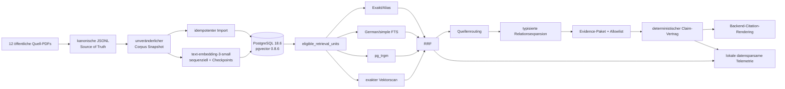
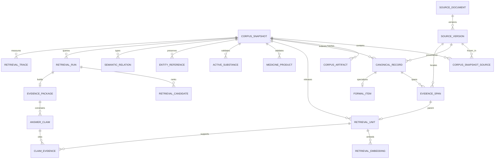

# Architektur und Datenmodell

## Systemgrenze

AISurgeon Decentralised ist in dieser Phase eine lokal kontrollierte
Retrieval-Forschungsinfrastruktur. Kanonische JSONL-Dateien und öffentliche
Quell-PDFs sind dauerhaft maßgeblich. PostgreSQL/pgvector kann vollständig aus
dem Snapshot und den Embedding-Checkpoints neu aufgebaut werden.

## ER-Modell

## Vertrauensgrenzen

1. Die Snapshot-Erzeugung verifiziert Quell- und Canonical-Hashes vor jeder
   Verwendung.
2. Die Security-Barrier-View `retrieval.eligible_retrieval_units` ist der
   einzige normale Such-Gateway. Alle sechs SQL-Funktionen bauen darauf auf.
3. Relationsexpansion beginnt nur bei hoch gerankten Seeds, ist typisiert,
   limitiert und kennzeichnet Ergebnisse als `linked_context`.
4. Das Evidence-Paket bindet Snapshot, ID-Reihenfolge, Text-Hashes und Locator
   kryptografisch. Unbekannte, fremde oder ausgeschlossene IDs scheitern
   fail-closed.
5. Ein Sprachmodell kann nur Supportstatus und Allowlist-IDs liefern. Citation-
   Metadaten werden nie vom Modell übernommen.

Die aktuelle Implementierung ist eine technische Forschungsbaseline, keine
klinische Sicherheitsarchitektur.
