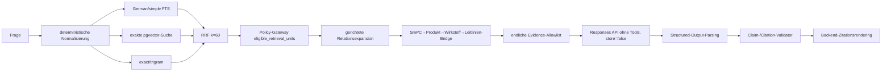

# Geschlossene RAG-Forschungspipeline als CLI

## Scope

Phase 1 implementiert ausschließlich eine wiederverwendbare Python- und
CLI-Pipeline. Eine Web-App und ein Frontend sind nicht Bestandteil dieser
Phase. Der Prototyp ist nicht klinisch validiert.

Der eingefrorene Korpus ist Snapshot
`cs-f61b3d4e90089c1b890c23cb` mit 4.469 Retrieval-Einheiten und 4.469 bereits
vorhandenen `text-embedding-3-small`-Embeddings (1.536 Dimensionen). Die
kanonischen JSONL-Dateien bleiben Source of Truth; PostgreSQL/pgvector bleibt
ein regenerierbarer Index.

## Komponentenfluss



Alle normalen Such-, Relations- und Evidenzpfade passieren
`retrieval.eligible_retrieval_units`. Die Baseline nutzt keinen ANN-Index.
FTS ist PostgreSQL-Volltextsuche und wird nicht als BM25 bezeichnet.

## Gerichtete Arzneimittelbrücke

`smpc_guideline_bridge.jsonl` ist ein auditierbarer, abgeleiteter Katalog und
keine Änderung am kanonischen Korpus. Die Richtung ist ausschließlich
`smPC_to_guideline`. Ausgang sind validierte, derselben Fachinformation
zugeordnete Produkt- und Wirkstoffentities; die historisch kontaminierte
Crosswalk-Aliasdatei wird nicht als Aliasautorität genutzt.

Aktiviert werden nur exakte oder kontrolliert normalisierte Aliasnennungen in
policy-zulässigen Leitlinienrecords. `semantic_candidate` wird nicht automatisch
aktiviert. Ein fehlender Match ist zulässig (`unmatched_no_error`). Treffer der
HCC/BCC-Konsultationsfassung bleiben als `consultation_draft` sichtbar und
werden nicht still als final behandelt.

Geprüfter Stand:

- 9 importierte SmPC-Quellen;
- 140 Source/Substance/Target-Matrixzeilen;
- 139 aktive belegte Zielrelationen;
- 17 formale und 122 nichtformale Leitlinienziele;
- 31 Ziele in der explizit markierten Konsultationsfassung;
- 1 nicht verknüpfter Source/Substance-Fall (`Berahyaluronidase alfa`), kein
  Fehler;
- 0 Rückwärtsrelationen und 0 automatisch aktive semantische Kandidaten.

## Geschlossene Providergrenze

Der Responses-Aufruf erhält nur:

1. die aktuelle Frage;
2. versionierte Antwortregeln;
3. IDs, Rollen, Status, Komponenten und exakte Texte der endlichen lokalen
   Evidence-Allowlist.

Nicht übertragen werden PDFs, Datenbankzugang, Dateisystemzugang oder nicht
ausgewählte Korpusinhalte. Der Aufruf setzt `store=false`, `tools=[]`,
`tool_choice=none` und `parallel_tool_calls=false`. Es gibt keine Websuche,
File Search, MCP-, Code-Interpreter- oder Function-Tools. Structured Outputs
werden direkt über das Responses-API-Schema geparst. Die Implementierung folgt
der offiziellen OpenAI-Dokumentation zu
[Structured Outputs](https://developers.openai.com/api/docs/guides/structured-outputs).

`OPENAI_RESPONSE_MODEL` kann das Modell konfigurieren. Der geprüfte Lauf nutzte
den Snapshot `gpt-5.4-nano-2026-03-17`, Reasoning-Level `none` und höchstens 700
Output-Tokens. Der No-context-Arm verwendet dasselbe Modell, denselben Snapshot,
dasselbe Reasoning-Level, dieselbe Ausgabegrenze und dasselbe Schema, erhält
aber keine Retrieval-Evidenz und ist vom Backend grundsätzlich nicht als
evidenzvalidierte Antwort publizierbar.

## Claim- und Citation-Vertrag

Das Modell liefert nur `answer_status`, `answer_text`, `claims`, `limitations`
und `abstention_reason`. Claims enthalten Text, Evidence-IDs und Supportstatus.
Der Backend-Validator prüft insbesondere Allowlist-Zugehörigkeit, Eligibility,
Snapshot, Quellenlokator, Dokumentstatus, Zahlen/Dosen, Einheiten, Route,
Population und Negation. Eine unbekannte oder erfundene ID verwirft die
Antwort. Sichtbare Dokument-, Versions-, Seiten- und Linkangaben entstehen
ausschließlich aus Backend-Metadaten.

Eine leere, inhaltlich freie Abstention kann nach vollständig ausgeführtem
Fallback als `no_validated_evidence` publiziert werden, auch wenn der Retriever
zuvor Kandidaten fand, diese aber keine ausreichende Beleggrundlage darstellen.
Ein technischer Retrievalfehler ist keine No-evidence-Aussage.

## Telemetrie

Operative JSONL-Traces speichern keine vollständigen Fragen oder Antworten.
Erfasst werden Question-Hash, Run-/Question-ID, Arm, Snapshot, Prompt-/Schema-
Version, Modell-/Embeddingmodell, Kanalränge, RRF, Evidence-IDs, lokale DB-,
Retrieval-, Relations- und Ressourcenmetriken, Provider-Wall-Time,
`openai-processing-ms`, `x-request-id`, HTTP-/Retrydaten, Rate-Limit-Header,
Tokenfelder, Kostenschätzung und Validatorstatus. CPU, RAM und I/O beziehen
sich nur auf den lokal kontrollierten Prozess.

## Reproduktion

```bash
uv sync --dev
uv run python scripts/retrieval_stack.py start
uv run python scripts/build_smpc_guideline_bridge.py
uv run python scripts/audit_rationale_relations.py
uv run python scripts/run_rag_benchmark.py \
  --snapshot-id cs-f61b3d4e90089c1b890c23cb
uv run pytest -q
```

`response_runs.jsonl` ist der API-Checkpoint. Beim Resume werden vorhandene
Responses nicht erneut berechnet; `response_runs_validated.jsonl` wird mit dem
aktuellen lokalen Validator deterministisch neu abgeleitet. Query-Embeddings
sind pro Frage, Snapshot und Modell gzip-checkpointed und enthalten keinen
Fragetext.

## Development-Ergebnis

Die 20 VTE-Fragen sind `synthetic_draft`, davon 17 source-derived belegte und 3
Out-of-scope-Fälle. Sie sind kein finaler unangetasteter Testdatensatz.

| Arm | Hit@1 | Recall@3 | Recall@5 | MRR | nDCG@5 | No-evidence korrekt |
|---|---:|---:|---:|---:|---:|---:|
| FTS | 0,118 | 0,206 | 0,206 | 0,167 | 0,161 | 0,667 |
| exakter Vektor | 0,765 | 0,735 | 0,735 | 0,765 | 0,737 | 1,000 |
| Hybrid-RRF | 0,588 | 0,559 | 0,618 | 0,600 | 0,588 | 1,000 |
| Hybrid-RRF + Bridge | 0,706 | 0,676 | 0,735 | 0,718 | 0,706 | 1,000 |

Die Bridge hebt die beiden produktbasierten Eliquis-/Xarelto-Fragen von keinem
Leitlinienitem im unüberbrückten SmPC-first-Pfad auf Item 8.1. Über alle 20
Fragen waren 80/80 deterministische Retrievalwiederholungen identisch.

Der Drei-Fragen-Smoke umfasste sechs Responses-Aufrufe. Die konservative
maximale Zusatzkostenschätzung für die restlichen 34 Aufrufe betrug 0,072725 USD
und lag damit unter 2 USD. Im vollständigen Lauf waren alle 26 gerenderten
Closed-RAG-Zitations-IDs Teil der jeweiligen Allowlist. Diese technische
Development-Auswertung ersetzt keine unabhängige klinische Annotation.
